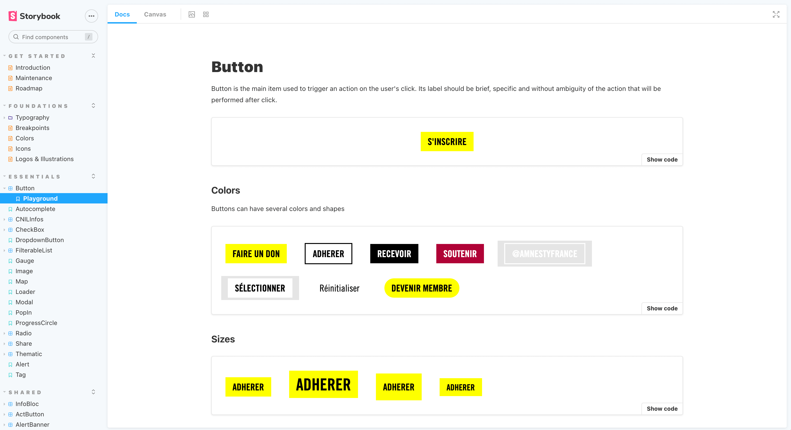

> This article has originally been published into [Troopers Web Republic](https://slash.troopers.agency/article/documenter-les-composants-de-son-interface-avec-storybook)'s blog

Storybook offers the front-end developers an isolated development environment, but it also provides everyone an interface to manipulate the system's components, to check all their states for multiple screen resolutions.

Until recently, this project was quite complex to setup: you needed to install various plugins, finely tune Webpack... Only enterprises that could afford to invest a lot of time into their design system. 

However, the last release simplified the process a lot and [Storybook](https://storybook.js.org/) can now (almost) be setup in one line!

## Install Storybook into an existing project

```bash
 npx sb init
```

This one line is the only thing you need when you want to install Storybook into an existing project. It can detect which framework you use (React, Vue, Angular...) to install the required dependencies. It is compatible with both JavaScript end TypeScript.

Some story samples get also created so you can get inspired to write your owns... and that's all!

<Image isSmall>


</Image>

## Document a component and its variants as Stories

For every component, you now need a `ComponentName.stories.js` file. It will be used to aggregate the stories of the given component.

These files can be created anywhere in your project: the default Storybook config will understand all files named `*.stories.js` as Storybook story. But for maintenance purposes and to keep your code well organized, it is recommended to keep the Stories just next to the component they refer to.

Let's try to apply this concept with an Avatar component. It should display the photo of a user and, if the picture is not defined, it should only show the contact initials.

```jsx
// Avatar.js

const Avatar = ({ src, firstname, lastname }) => {
	if (!picture) {
		const initials = getInitials(firstname, lastname)
		return <div className="avatar empty">{ initials }</div>
	}
	return <div className="avatar">
		
	</div>
}

Avatar.propTypes = {
	src: PropTypes.string,
	firstname: PropTypes.string.isRequired,
	lastname: PropTypes.string.isRequired
}

export default Avatar
```

It is important to write a Story for every state of the component so that all stakeholders can discover the variants it offers, questions them, fixes them, evolve them....

Storybook development teams have normalized the way a story should be formatted and called it [Component Story Format (CSF)](https://storybook.js.org/docs/react/api/csf) : 
- module default export contains the meta-data (title, description, decorators...)
- each named export is a story that should appear in the documentation.

If you want to dig deeper into CSF philosophy and learn about all of its options, you can read [the official documentation](https://storybook.js.org/docs/react/writing-stories/introduction) or [some Medium articles the team wrote](https://medium.com/storybookjs/component-story-format-66f4c32366df).

```jsx
// Avatar.stories.js
import Avatar from './Avatar'

export default {
	title: 'Components/Avatar',
	component: Avatar
}

const Template = args => <Avatar {...args} />
Template.args = {
	firstname: 'Anakin',
	lastname: 'Skywalker'
}

export const withPicture = Template.bind({})
withPicture.args = {
	...Template.args,
	src: 'https://theoldrepublic.space/anakin-skywalker.jpeg'
}

export const withoutPicture = Template.bind({})

```

6th version introduced the *args* notion. Before it, you needed to install an optional add-on called [knobs](https://www.npmjs.com/package/@storybook/addon-knobs). Now, [Controls add-on](https://storybook.js.org/docs/react/essentials/controls) is installed by default and let you edit the story property on the fly. Therefore the component becomes editable right from the Storybook interface, and everyone is able to test its behaviors and edge cases.

> How will the Avatar look if Yoda (who has no lastname) don't have a profile picture yet.

<Image isSmall>


</Image>

## Editorial pages in MDX
In the near future, we'll certainly talk in this blog about design tokens and how to use them to build a consistent UI. Meanwhile, you can have a look at [this presentation](https://spectrum.adobe.com/page/design-tokens/) from Spectrum, by Adobe.
In order to be used by every member of the project, design tokens need to be easily discoverable. As they're not independent components, they can't have their own story.

MDX is a document format to write Markdown text and interpret JSX that is used to integrate React components. Storybook is able to read and display documents in this format. Therefore it can be used to create editorial pages that will document the design tokens defined in our product.

```mdx
// DesignTokens.stories.mdx
import { Meta, Canvas } from '@storybook/addon-docs'
import Color from './Color'

<Meta title="Foundation/DesignTokens" />

# DESIGN TOKENS

## Sizes

### Fonts

| Name   | Value |
|--------|-------|
| small  | 12px  |
| base   | 16px  |
| large  | 20px  |
| header | 32px  |

### Spacings

| Name | Value |
|------|-------|
| m-1  | 4px   |
| m-2  | 8px   |
| m-3  | 12px  |
| m-4  | 16px  |
| m-5  | 20px  |
| m-6  | 24px  |

## Colors

<Canvas>
	<Color name='primary' value='#00FFFF' />
	<Color name='secondary' value='#00FF00' />
	<Color name='black' value='#000000' />
	<Color name='white' value='#FFFFFF' />
	<Color />
</Canvas>
```

The Color component is an example of an external component that has been created only to preview hexadecimal color and make our documentation convenient. It is imported and used in the document the same way we use components in JavaScript.

Another use case for MDX mages can be documenting the tone of voice of the product, link to external Figma components, present the contribution process of a design system... Opportunities are endless!

## Deploy Storybook 

Now Storybook contains your UI's components, and it has been enriched by some editorial contents, it needs to be reachable by everyone in the organization. If you have to ask your colleague to clone the project and compile Storybook before they can view it on their local computer, you're sure they will never use it, and all of your documentation work will be vain.

That's why we'll use the high-quality CI offered by Gitlab. It can be configured in the project's repository, in a single file `gitlab-ci.yml.`.  Here is the base we use in our own project. Now, you need to adapt it from your own.

```yaml
# .gitlab-ci.yml
pages:
  image: node:14
  stage: .post
  cache:
    key: '$CI_BUILD_NAME'
    untracked: true
    paths:
      - node_modules
  script:
    - yarn install
    - rm -r public
    - yarn build-storybook
  artifacts:
    paths:
      - public
  only:
    - develop
```
 
With this configuration, Storybook will be rebuilt after each merge on `develop` and deployed to https://your-organisation.gitlab.com/your-project-name.

## Who should pay for Storybook?

If you're developing your own project, this is not a question: setup a Storybook from the beginning and your future you will thank you!

<Image isSmall>


</Image>

However, for an agency that's working on external projects, every working hour have to be billed to the final client. That's why we can wonder if it worth the cost as our client money is not illimited.

You've seen that you can install and deploy Storybook for practically nothing. Like you're inflexible on testing your code for security purposes, you can now be intransigent in setup Storybook to create a consistent and persistent UI.

I hope this article made your mouth water. For a brighter view of what Storybook looks like, you should check at those of Lonely Planet for their design system called [BackpackUI](https://lonelyplanet.github.io/backpack-ui/), IBM for [Carbon](https://react.carbondesignsystem.com/), or even Salesforce for [Lightning](https://design-system-react-components.herokuapp.com/). They use editorial pages to present general concepts, design tokens, and component pages to visualize several component states. You'll notice that they're not using Storybook v6 for now, and the three of them have Knob add-on to manipulate component contents.

Don't be scared when discovering all the stories in the examples above, and wondering how your PO/client will let you enough time to setup everything. The crucial step is to create an empty Storybook, setup the CI, and create the first story. You'll then be able to add stories when you'll work and refactor components.

This is the philosophy we've adopted at [Troopers](https://troopers.agency) for our client [Amnesty International France](https://amnesty.fr). The Storybook has been initialized in December 2019, and it's a project that is still going on. We benefit from every sprint to feed it with the component we develop or edit.

