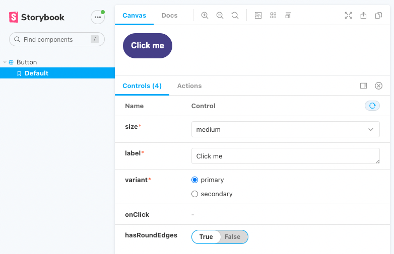

The main purpose of Storybook is to create a catalog of component "stories." Each story represents how a component will render in one of its specific states. 

# Component Story Format: an open standard to write stories

Recent stories implementations are based on an open and technology-agnostic format called “Component Story Format”, abbreviated CSF. Even if the Storybook core team is part of its contributor, the fact they’re not alone is precious. It means, we can re-use what we’ve developed beyond Storybook, in order to integrate the stories into other tools of the stack, like Cypress or Testing Library.

However, despite the openness of CSF, other component development environments ([Styleguidist](https://react-styleguidist.js.org/), [Docz](https://www.docz.site/), [React Cosmos](https://reactcosmos.org/)…) didn’t embrace the format. They preferred their own proprietary format.

Basically, the CSF works like this: one default export for metadata, and one export for each story of the component. Every story is a function that returns a mounted component

```tsx
export default {
	title: 'HelloWorld'
	component: HelloWorld
  // ... other metadata
}

export const WithoutName = () => <HelloWorld />
export const WithName = () => <HelloWorld name={"David"} />
```

Since stories are live components, they can handle all user interactions that the web standard allows: clicks, hover, focus, changing browser size or color scheme, etc. This is why Storybook is a powerful tool for documenting a component and its interactions, even for non-developers.

## Args are the new props

If you come from React development, you are likely used to using `props` to customize a component's behavior based on external inputs.

Storybook has retained this logic, but to remain framework agnostic, it has renamed it "arguments" (or `args`). Arguments are defined as a property of the story function.

```tsx

export const WithoutName = () => <HelloWorld />
export const WithName = (args) => <HelloWorld {...args} />
WithName.args = {
	name: 'David'
}
```

Args are just plain JavaScript objects, so you can manipulate default values in any way you can imagine using the language. This is why practices can vary depending on the component library and the team maintaining it.

```tsx

// Default props as an external object
const DEFAULT_PROPS = {
	label: 'Click me'
	onClick: () => console.log('clicked')
}

export const Default = (args) => <Button {...args} />
Default.args = DEFAULT_PROPS

export const Disabled = (args) => <Button {...args} />
Disabled.args = {
	...DEFAULT_PROPS,
	disabled: true
}

export const WithEmojiLabel = (args) => <Button {...args} />
WithEmojiLabel.args = {
	...DEFAULT_PROPS,
	label: 'Click me 😎'
}

// ----------------------------------------
// Default props defined in the first story

export const Default = (args) => <Button {...args} />
Default.args = {
	label: 'Click me'
	onClick: () => console.log('clicked')
}

export const Disabled = (args) => <Button {...args} />
Disabled.args = {
	...Default.args,
	disabled: true
}

export const WithEmojiLabel = (args) => <Button {...args} />
WithEmojiLabel.args = {
	...Default.args,
	label: 'Click me 😎'
}
```

While there are various ways to do this, I recommend choosing one method for all stories and keeping the code consistent. This will improve the developer experience and make contributions easier.

The recommended format is to use CSF metadata to store default props. Storybook will automatically integrate the `args` property from the metadata and override variations if the `args` property of the story is defined.

```tsx
export default {
	args: {
		label: 'Click me'
		onClick: () => console.log('clicked')
  }
}

export const Default = (args) => <Button {...args} />
export const Disabled = (args) => <Button {...args} />
Disabled.args = {
	disable: true
}
export const WithEmojiLabel = (args) => <Button {...args} />
WithEmojiLabel.args = {
	label: 'Click me 😎'
}
```

## One Template to rule them all

The CSF is declarative, but writing a different function for each scenario can be repetitive and difficult to maintain in the long run. This is why it is recommended to start with a template story that can be duplicated and modified for each scenario.

```tsx
const Template = (args) => <Button {...args} />

const Default = Template.bind({})

const WithEmojiLabel = Template.bind({})
WithEmojiLabel.args = {
	label: 'Click me 😎'
}
```

For simple variations, it may seem unnecessary to create and duplicate a template function. However, as soon as you add more complex stories, you will benefit from having a foundation component that you can customize depending on the scenario you need to document.

Additionally, the front-end development team is not the only user of a Storybook. Visitors will be able to more easily understand how they are expected to interact with the component if all its stories look similar.

# Control the arguments passed to the story

Storybook benefits from a composable UI that can be enhanced by a variety of add-ons. One of the most popular is named "Controls": it offers a side panel where arguments passed to the story can be edited using form fields. It makes the testing process smooth by allowing any visitor to check how the component behaves in multiple situations.

The add-on will automatically create the form fields depending on the PropTypes definition (for JavaScript components), and from the Props interface (for TypeScript components).

For example:

- text input for string arguments
- toggle input for boolean arguments
- radio buttons or a select for enums

<Image>


_The story of a Button component and its Controls panel_
</Image>


## Customizing the argument fields

As a component developer, the automatic definition is very convenient, but you can go even further and customize the fields to optimize the experience for your visitors.

### Control the controls

Technically speaking, each story file will receive an `argTypes` parameter, whose value is inferred from the component's props. The Controls add-on uses this value to generate the form. That's why it is possible to edit how the Controls panel will look by editing the `argTypes`, at the file level or at the story level.

```tsx
export default {
	argTypes: {
		// some metadata
	},    
}

export Default = Template.bind({})
Default.argTypes = { /* other metadata */ }
```

### Filter the fields

To go even deeper into customization, you can edit the metadata of the add-on using the `controls` parameter. For a comprehensive presentation of what is offered, I recommend you to have a look at the [documentation](https://storybook.js.org/docs/react/essentials/controls) page on the Storybook website.

The parameters that I use the most are `include` and `exclude`, which filter the fields in the Controls panel. They are useful when your component inherits many props from its parent, but you only need to make a few specific props editable in Storybook, or you need to hide all event handlers and callbacks.

```tsx
export default {
	title: 'Button',
	component: Button,
	{
		// *do not show the controls for props starting with "on"
		// usually onChange, onBlur, onSubmit...*
		{ controls: { exclude: /^on.*/ } }
	}
}

export Disabled = Template.bind({})
Disabled.parameters = {
		controls: {
			// the only control visible will be the one for the *"disabled"* props
			{ controls: { include: ['disabled'] } }
		}
	}

```

# Create wrappers around the components

It is rare to have all your components totally pure functions and receive all of their dependencies from props injection. Modern front-end frameworks often benefit from context injection to improve the developer experience. Some examples of contexts that might be injected include:

- data from a Redux store
- the theme of the styled-components
- translations from the i18n context
- …

You can add context containers around the components using the template function, but a cleaner approach is to use the `decorators` property.

```tsx
import Avatar from "./Avatar";
import { UserProvider } from "./UserContext";
export default {
  title: "Avatar",
  component: Avatar,
  decorators: [
    (Story) => (
      <UserProvider>
        <Story />
      </UserProvider>
    )
  ]
};

const Template = (args) => <Avatar {...args} />;

export const Default = Template.bind({});

export const WithAPhoto = Template.bind({});
WithAPhoto.decorators = [
  (Story) => (
    <UserProvider avatar="https://picsum.photos/100/100">
      <Story />
    </UserProvider>
  )
];
```

This way will keep the story logic separated from the wrapper logic, which increases the story file's legibility and increases its maintainability. Bonus point: having the context containers declared in the decorators makes them easier to be extracted into separated files for better reusability across the stories if needed.

# Conclusion

Storybook is an interactive component catalogue that can be used by both technical and non-technical users. Developers need to be able to search for existing components and understand quickly how they are supposed to be used, while non-technical profiles can use the sandbox to check what has been developed previously and how the component can be adapted to a new context. It is important for stories to be explicit and easy to maintain in order to serve these users.

We've seen that the Component Story Format (CSF) is the default format used to describe the behavior of a story, but did you know you can also use [Markdown](https://storybook.js.org/docs/react/api/mdx) for more flexibility in documentation? The CSF syntax presented in this article is version 2.0. Version 3.0 was announced last year and is expected to reduce boilerplate and eliminate the need for `Template.bind({})`. Personally, I am excited to adopt it.