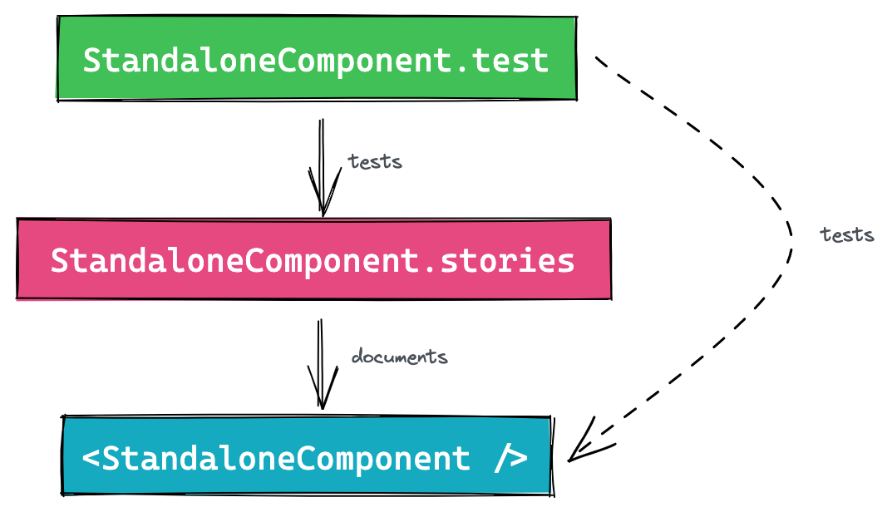

# Pourquoi faut-il tester vos stories ?

Au premier abord, il peut sembler contre-intuitif de tester les stories. Si votre processus de développement implique de commencer par Storybook et de créer des composants isolés qui sont ensuite ajoutés à l'application web, il peut sembler qu'il n'y ait pas besoin de tester les histoires, puiqu’elles seront toujours fonctionnelles. Cependant, ce n'est pas toujours le cas.

Au fur et à mesure que votre équipe se développe, vous aller embaucher de nouveaux coéquipiers qui ne sont pas habitués à développer avec Storybook. Lorsqu'ils ont besoin de mettre à jour un composant existant, ils vont vérifier que l'intégration avec le code de l’application métier répond aux nouvelles spécifications et mettre à jour les tests, que vous aurez automatisés dans la CI. Cependant, s'ils effectuent un changement majeur, comme la modification d'un nom ou du type d’une props, ils ne vont pas nécessairement se rendre compte que les stories existantes ne fonctionnent plus. Et si le composant est utilisé comme bloc pour la composition d'autres composants de plus haut niveau, ces stories peuvent également être bugguées. Petit à petit, c’est donc toute votre système de documentation qui sera inutilisable.

Même si vous vous efforcez de sensibiliser vos coéquipiers aux avantages de l'utilisation de Storybook et à l'importance de le maintenir à jour, il est toujours possible que les êtres humains commettent des erreurs (selon la loi de Murphy). Le seul moyen d'empêcher cela est de tester automatiquement le code Storybook, tout comme vous testeriez votre code métier. Cela contribuera à garantir que vos composants et leur documentation sont toujours à jour. En résumé, la solution à ce problème consiste à tester les stories.

<Image isSmall>



</Image>

1. Le composant est rendu dans Storybook à des fins de documentation
2. Le test vérifie que la story est rendue comme prévu
3. En fin de compte, le composant est testé 🥳

Il y a quelques années, nous n'avions pas les outils nécessaire pour intégrer ce workflow dans votre process de développement. Cependant, depuis la sortie de CSF 2.0, des outils externes ont intégré le format et il est désormais possible d'adopter cette philosophie sans trop de difficultés.

# Les principaux avantages de baser les tests sur les histoires

## Ne pas dupliquer les scénarios

Il est recommandé de créer une story pour chaque cas d'utilisation d'un composant, afin de documenter toutes ses variants. Il est également recommandé de créer un test par cas d'utilisation pour s'assurer que le composant continue de fonctionner correctement au fil du temps.

En basant les tests sur les story, vous éviderez ainsi de dupliquer le scénario et pourrez l’utiliser à la fois à des fins de documentation et de test.

## Créer un aperçu visuel des tests Jest

Les tests Jest reposent sur un rendu headless et peuvent être difficiles à interpréter lorsqu'ils buguent. Lorsque vous rencontrez des problèmes inattendus, vous devez souvent logguer le HTML dans la console pour essayer de comprendre ce qui se passe. Cela peut être particulièrement fastidieux lorsqu’il s’agit de prévisualiser des composants complexes ou des pages entières.

En commençant par la story, vous pouvez prévisualiser comment le composant sera affiché dans un vrai navigateur, en fonction de ses données (props et state) et de la façon dont l'utilisateur peut interagir avec lui. Cela va faciliter la compréhension et le débogage de tout problème que vous rencontrerez lors de l’écriture de vos tests.

## Fournir uniquement les contextes requis une seule fois

Les composants complexes nécessitent souvent des contextes externes tels que le router, les data stores et l'internationalisation pour fonctionner correctement. Même les plus petits composants peuvent nécessiter des contextes, comme pour le thème de l’application par exemple.

Si vous avez deux mécaniques distinctes pour la documentation et les tests des composants, vous devrez configurer et créer ces wrappers deux fois. En utilisant les stories comme source de vérité, vous aller éviter ce travail supplémentaire et ne définir les contextes requis une seule fois.

# Comment tester les stories avec Jest?

Si vous êtes toujours en train de lire, j'espère que vous avez été convaincu de l'importance d'utiliser les scénarios Storybook comme fondement de vos tests de composants. Voici les étapes à suivre pour mettre en œuvre cela techniquement :

Pour simplifier cet article, je vais supposer que vous êtes déjà familier avec [Testing Library](https://testing-library.com/) et que vous avez une instance Storybook active avec des stories basées sur [CSF 2.0](https://storybook.js.org/docs/react/api/csf).

## Installez le plugin de test

Tout d’abord, vous devrez installer le plugin Storybook compatible avec votre stack de développement. Par exemple, si comme moi vous développez avec React, vous pourrez installer `@storybook/testing-react`. De la même facon, si vous travaillez avec Angular ou Vue, vous devrez installer `@storybook/testing-angular` ou `@storybook/testing-vue`.

## Utiliser des stories dans le fichier de test

Un fichier de test simple ressemble généralement à ceci :

```tsx
import { render, fireEvent } from '@testing-library/react'
import '@testing-library/jest-dom'

import Toggle from './Toggle'

test('<Toggle />', () => {
	const toggleLabel = 'Toggle'
	const { getByText, getByTextLabel} = render(
		<Toggle label={toggleLabel} />
	)
	fireEvent.click(getByText(toggleLabel))
	expect(getByTextLabel(toggleLabel)).toBeChecked()
})
```

Même pour un petit composant, près de la moitié des instructions de test sont utilisées pour mettre le composant dans le bon état, que nous avons déjà configuré lors de la création de la story.

Le plugin de test Storybook offre des fonctions qui vous permettent de lier les définitions de story aux args et métadonnées et de créer des composants prêts à être rendus.

```tsx
import { render, fireEvent } from '@testing-library/react'
import '@testing-library/jest-dom'
import * as stories from './Toggle.stories'
import { composeStories } from '@storybook/testing-react'
const { Default } = composeStories(stories);

test('<Toggle />', () => {
	render(<Default />)
	// ...
})
```

Chaque composant renvoyé par `composeStories` est mappé sur les stories et inclut déjà tous les décorateurs du niveau de la story, du niveau de la méta et du niveau global. Cela peut considérablement simplifier le processus d'écriture de tests.

Si vous avez besoin d'accéder aux arguments de la story, vous pouvez les obtenir à partir du résultat de `composeStories`.

```tsx
import { render, fireEvent } from '@testing-library/react'
import '@testing-library/jest-dom'
import * as stories from './Toggle.stories'
import { composeStories } from '@storybook/testing-react'
const { Default } = composeStories(stories);

test('<Toggle />', () => {
	const { getByText } = render(<Default />)

	fireEvent.click(getByText(Default.args.label))
	expect(getByLabelText(Default.args.label)).toBeChecked()
})
```

# Conclusion

En conclusion, tester les stories à l'aide de Jest est une étape cruciale pour garantir que vos composants Storybook fonctionnent correctement sur le long terme. Les exemples présentés ci-dessus sont basés sur Testing-Library, mais l'utilisation d'Enzyme pour tester vos stories est similaire.

Si vous préférez utiliser Cypress, la fonctionnalité [Component Testing](https://docs.cypress.io/guides/component-testing/overview) peut être utilisée à cette fin. La configuration a été expliqué dans [un article de blog](https://www.cypress.io/blog/2021/05/19/cypress-x-storybook-2-0/) et ne semble à priori pas être complexe si vous avez déjà configuré les tests de composants dans votre repository. Cependant, à titre personnel, je n’utiliserais pas Cypress que je trouve trop long à lancer et je ne souhaite pas surcharger mon temps de CI avec cette solution.

Quel que soit l'outil que vous préférez, vous êtes donc à présent en mesure de tester vos stories, de vous assurer une documentation toujours à jour, ce qui vous fera gagner du temps et réduira vos efforts sur le long terme.