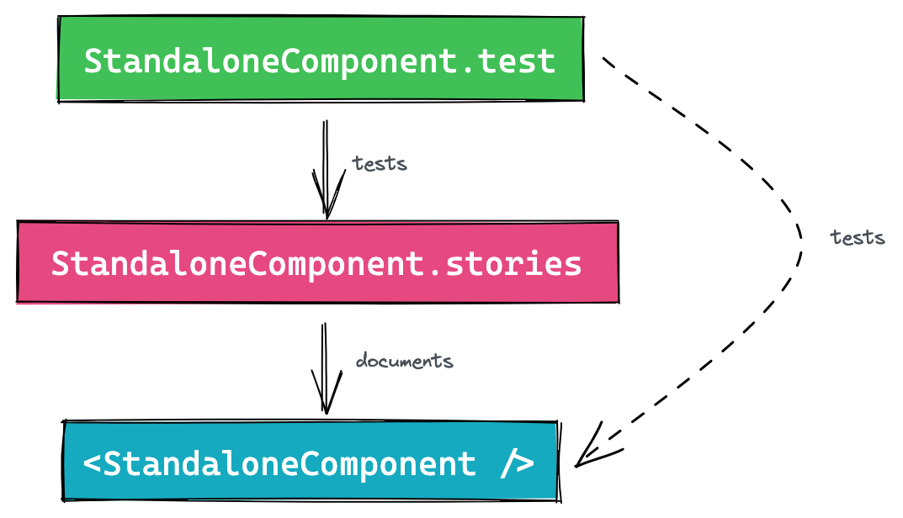

## Why should you test your stories?

At first glance, it may seem counter intuitive to test stories. If your development process involves starting with Storybook and creating isolated components that are later added to the web app, it may seem like there is no need to test stories. However, this is not always the case.

As your team grows, you may hire new teammates who are not used to developing with Storybook. When they need to update an existing component, they may check the integration with the user-facing code to ensure it meets the new specifications and update the automated tests as part of the CI process. However, if they make a breaking change, such as editing a prop name or type, they may not realize that the existing stories are no longer working. If the component is used as a building block for other components, those stories may also break.

Even if you make an effort to educate your teammates about the benefits of using Storybook and the importance of keeping it up to date, it is still possible for humans to make mistakes (as per Murphy's law). The only way to prevent this from happening is to automatically test the Storybook code, just as you would test your business code. This will help ensure that your components and their documentation are always up to date. To sum up, the solution to this problem is to test the stories.

<Image isSmall>



</Image>

1. The component is rendered in Storybook for documentation purposes
2. The test ensures the story renders as expected
3. In the end, the component gets tested 🥳

A few years ago, we didn't have the required technology to smoothly integrate this flow into your process. However, since the release of CSF 2.0, external tools have integrated the format and it is now possible to adopt this philosophy without too much trouble.

## Key advantages of basing tests on stories

### Avoid duplicating scenarios

It is recommended to create one story for every use case of a component in order to document all of its possibilities. It is also recommended to create one test per use case to ensure that the component continues to work correctly over time.

By basing tests on stories, you can avoid duplicating the scenario and use it for both documentation and testing purposes.

### Visual preview of Jest tests

Jest tests that are based on headless rendering can be challenging to understand when things go wrong. When you encounter unexpected issues, you often have to log the HTML in the console to try to understand what's happening. This can be especially difficult when testing complex components or whole pages.

By starting with a story, you can preview how the component is rendered in the browser, based on its data (props and state) and how the user interacts with it. This can make it easier to understand and debug any issues that arise.

### Only need to provide required contexts once

Complex components often require external contexts like routing, data stores, and internationalization to work properly. Even smaller components may require these contexts, such as for theming.

If you have two separate mechanisms for documenting and testing components, you will have to set up and create these wrappers twice. By using stories as the source of truth, you can avoid this extra work and only need to provide the required contexts once.

## How to test stories using Jest?

If you're still reading, I hope you've been convinced of the importance of using storybook scenarios as the foundation of your tests. Here are the steps you need to follow to implement this technically:

To keep this article simple, I'll assume you are already familiar with [Testing Library](https://testing-library.com/) and that you have a running Storybook instance with stories based on [CSF 2.0](https://storybook.js.org/docs/react/api/csf).

### Install the required plugin

First of all, you need to install the Storybook plugins that are compatible with your development stack. For example, if you are a React developer like me, you can install `@storybook/testing-react`. Alternatively, if you are working in an Angular or Vue environment, you can install `@storybook/testing-angular` or `@storybook/testing-vue`, respectively.

```bash
yarn add @storybook/testing-react
```

### Use stories into the test file

A simple testing file usually looks like the following:

```tsx
import { render, fireEvent } from '@testing-library/react'
import '@testing-library/jest-dom'

import Toggle from './Toggle'

test('<Toggle />', () => {
	const toggleLabel = 'Toggle'
	const { getByText, getByTextLabel} = render(
		<Toggle label={toggleLabel} />
	)
	fireEvent.click(getByText(toggleLabel))
	expect(getByTextLabel(toggleLabel)).toBeChecked()
})
```

Even for a small component, half of the test instructions may be used to put the component in the right state, which we already configured when creating the story.

The Storybook testing plugin offers functions that allow you to bind the story definitions to the args and metadata and create ready-to-render components.

```tsx
import { render, fireEvent } from '@testing-library/react'
import '@testing-library/jest-dom'
import * as stories from './Toggle.stories'
import { composeStories } from '@storybook/testing-react'
const { Default } = composeStories(stories);

test('<Toggle />', () => {
	render(<Default />)
	// ...
})
```

Every component returned by `composeStories` maps to stories and already includes all decorators from the story level, meta level, and global level. This can significantly streamline the process of writing tests.

If you need access to the story args, you can obtain them from the result of `composeStories`.

```tsx
import { render, fireEvent } from '@testing-library/react'
import '@testing-library/jest-dom'
import * as stories from './Toggle.stories'
import { composeStories } from '@storybook/testing-react'
const { Default } = composeStories(stories);

test('<Toggle />', () => {
	const { getByText } = render(<Default />)

	fireEvent.click(getByText(Default.args.label))
	expect(getByLabelText(Default.args.label)).toBeChecked()
})
```

## Conclusion

In conclusion, testing stories using Jest is a crucial step in ensuring that your Storybook components are functioning correctly over time. The examples presented above are based on testing-library, but using Enzyme to test your stories is similar.

If you prefer to use Cypress, the [component testing feature](https://docs.cypress.io/guides/component-testing/overview) can be used for this purpose. The process for setting this up [has been explained in a blog post](https://www.cypress.io/blog/2021/05/19/cypress-x-storybook-2-0/) and does not seem to be complex if you have already configured component testing in your repository. However, it's worth considering whether the benefit of testing in a real browser is worth the time it takes for Cypress to warm up.

Regardless of which tool you choose, testing your stories is an important part of the development process and can save you time and effort in the long run.