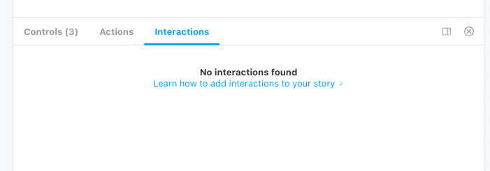

> A rich UI is not only determined by data from props and states, but also by user actions such as clicks and key presses.

## Introduction

Previously, the main purpose of Storybook was to showcase components and make their arguments editable. As a result, UI component developers often translated all possible states into editable props, such as:

```tsx
<Component isInitialState />
<Component isIntermediateState />
<Component isFinalState />
```

While this is useful during development, it can cause issues when multiple argument values are set as true. Solutions such as using a string enum or a TypeScript interface to prevent this can be implemented, but they fail to consider the user's perspective, in which the component should always progress from the initial state to the final state, passing through the intermediate state.

It is important to remember that a rich UI is not only determined by data from props and states, but also by user actions such as clicks and key presses. This is where the Storybook Play function comes in, it improves both the documentation and the props API of your component.

## Simulate user interactions in the stories

### Installing the addon

The Play function is a recent addition to the Storybook 6.4 release. To use it, you must have at least this version of Storybook installed. Additionally, you will need to install two additional packages: `@storybook/testing-library` and `@storybook/addon-interactions`

```bash
yarn add @storybook/testing-library @storybook/addon-interactions
```

Next, you will need to register the Interactions add-on in `.storybook/main.js` and restart Storybook.

```jsx
// .storybook/main.js
module.exports = {
  // ...
  addons: [
    // ...
    "@storybook/addon-interactions",
  ]
};
```

Now, you should see the Interactions tab in the lower panel and you can begin creating interactions.

<Image isSmall>



</Image>

### Writing user interactions

In the same way that you define a `.args` property on a Story to interact with the Control addon, you can define a `.play` function to interact with the component.

```tsx
const Default = Template.bind()
Default.play = () => {
	// your interactions
}
```

If you are familiar with `testing-library`, you will have no trouble using the same API for the `.play` function.

```tsx
import { screen, userEvent } from "@storybook/testing-library"

Default.play = () => {
	const openModalButton = screen.getByTestId('open-modal')
	userEvent.click(openModalButton)
	const closeModalButton = screen.getByTestId('close-modal')
	userEvent.click(closeModalButton)
}
```

By default, interactions and element research are executed from the top of the Storybook instance, which can cause performance issues, especially for large components. To improve performance, it is recommended to narrow the scope of the interaction and start from the component's root element.

```tsx
import { within, userEvent } from "@storybook/testing-library"

Default.play = ({ canvasElement }) => {
	const canvas = within(canvasElement)
	const openModalButton = canvas.getByTestId('open-modal')
}
```

If you need to access the component's arguments, the `.play` function's context provides the opportunity to integrate them into the automation.

```tsx
Default.args = {
	openModalButtonLabel: "Click me"
}

Default.play = ({ canvasElement, args }) => {
	const canvas = within(canvasElement)
	const openModalButton = canvas.getByText(args.openModalButtonLabel)
}
```

### Combining play functions

In the example presented in the introduction, we imagined a component that needs to pass through an intermediate state to reach the final state. If you were to develop story files for this component, you would create three stories - one for each state.

```tsx
const Initial = Template.bind({})
const Intermediate = Template.bind({})
const Final = Template.bind({})
```

Instead of copying and pasting user interactions from the `.play` function of the Intermediate story to the Final story, you can also execute `Intermediate.play` from `Final.play`, but don't forget to transfer the context from one function to another.

```tsx
const Initial = Template.bind({})
const Intermediate = Template.bind({})
Intermediate.play = () => {
	// ...
}
const Final = Template.bind({})
Final.play = (context) => {
	Intermediate.play(context)
}
```

## Testing user interactions

In the previous article, we saw how to base automated tests on Storybook stories. However, I also learned that it is possible to integrate assertion testing into the play function in Storybook 6.5. To do this, add `@storybook/jest` to your repository.

```bash
yarn add @storybook/jest
```

Then, use the `expect` function in the play function to assert that the UI is rendered as expected.

```tsx
import { userEvent } from "@storybook/testing-library"
import { expect } from "@storybook/jest"

Default.play = ({canvasElement, args} ) => {
	const canvas = within(canvasElement)
  const openModalButton = canvas.getByTestId('show-modal')
  await userEvent.click(openModalButton)
  expect(canvas.getByText(args.title)).toBeInTheDocument()
}
```

The integration is straightforward, but I personally find that if tests cannot be run automatically by CI, they are not worth maintaining in the long run as they create noise and frustration for the team in charge of their maintenance. [The Chromatic platform](https://www.chromatic.com/docs/interactions#how-to-write-interaction-tests) and the upcoming [Storybook 7.0](https://storybook.js.org/day) may offer more insights on this topic.

## Conclusion

Now you have all the tools necessary to improve your Storybook and make your documentation more closely match what the end user is expected to experience. If the repositories you're working on are not yet set up for the play function, I have created a sandbox ([GitHub repository](https://github.com/jsoulet/storybook-sandbox), [codesandbox](https://codesandbox.io/p/github/jsoulet/storybook-sandbox/master)) for you to see how it can enhance documentation and developer experience.