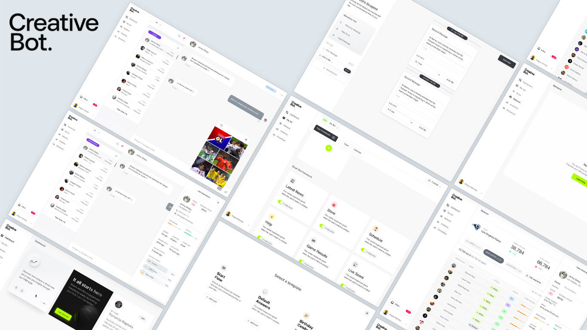
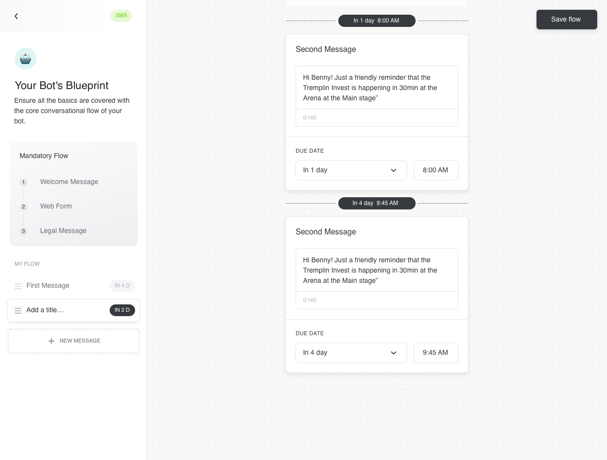
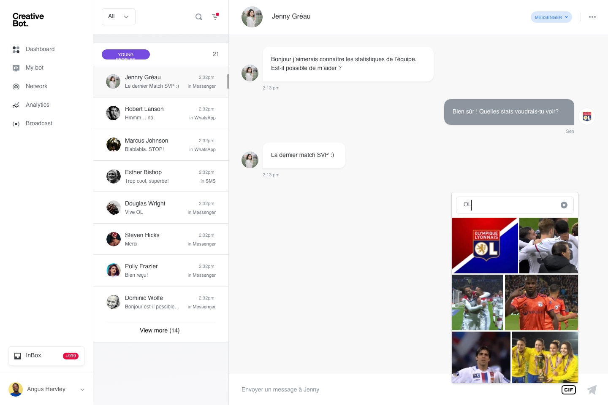
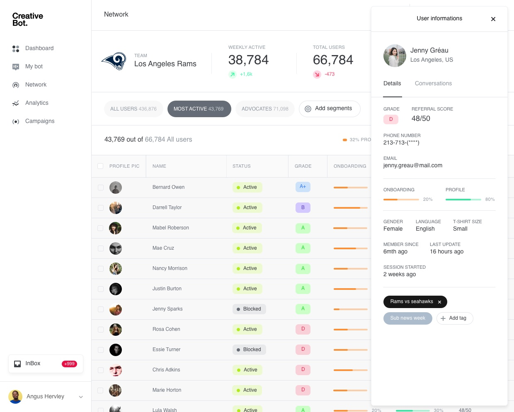

<Image>

</Image>

### Détails du projet

Creative Bot est une application web qui permet de connecter les grands clubs de sport à leurs fans grâces au plateforme de messaging : Facebok, Whatsapp, SMS...

Forts d'un premier MVP, je suis intervenu pour accélérer le développement de fonctionnalités clefs qui permettent à cette jeune start-up d'obtenir de nouveaux marchés. Au cours des différents développements, je suis aussi intervenu en tant qu'architecte conseil pour de renforcer la modularité des briques applicatives et uniformiser la base de code. Ensemble, nous avons revu l'arborescence des fichiers, mis en place un framework de tests unitaires et modernisé les divers outils et librairies internes.

#### Les points clefs

- Interface de création de chatbot
- Discussion en temps réel avec les fans
- Mise en place de filtres dynamiques de conversations
- Stack technique à jour avec les standards de l'industrie
- Stratégie de tests automatisés

> Mise à jour : Malheureusement, la pandémie de Covid-19 a eu un fort impact sur les métiers du sport professionel et, parce que les stades ont été fermés pendants des mois, les clubs n'ont pas voulu investir dans ce genre de plateforme. Creative Bot a donc du pivoter pour devenir une plateforme de communication par SMS qui aura un marché plus large que les clubs de sports.

<Button href="https://usedrop.io">Découvrir Drop</Button>

### Année
2020

### Screenshots

<Image>

</Image>

<Image>

</Image>

<Image>

</Image>
