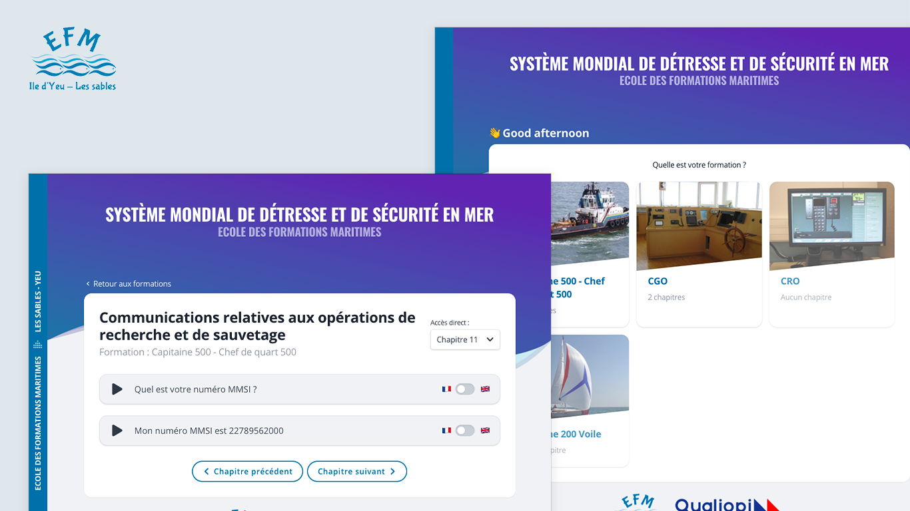

### Project Details

The Ecole des Formations Maritimes (Maritime Training School) is a school supervised by the French Ministry of the Sea. the Yeu Island and in the Sables d'Olonne, students are trained to become professionals sailors, from the seaman to the captain. During their training, the students have to practice the Global Maritime Distress and Safety System (GMDSS) using aggregated simulators. However, there are not enough simulators according to the class size, and that's why teachers organize training sessions using an interactive DVD: so the students can listen to the sentences both in French and in English before using the actual simulator. This solution has two major downsides :

1. The DVD is based on outdated technology (Flash), which is not compatible with web browsers since January 2021
1. Audio records are engraved into the DVD so teachers can't change them on every GMDSS update

I was challenged to find a practical solution for those two problems. That's why I built a web application based on a headless back-office. The educational team can now edit the content on the fly, without the need for additional development costs. Moreover, I based the development on HTML5 and JavaScript standards to ensure long-term compatibility.

About the UI design, it was important to create something more modern than what the DVD offered, but it was also important to keep it very simple and usable for people that are not used to handle web tools.

#### Highlights

- UX Design
- HTML5 standards
- React / TypeScript

<Button href="https://www.ecoledesformationsmaritimes.fr/">Discover EFM</Button>

### Year
2021

### Screenshots

<Image>

</Image>
