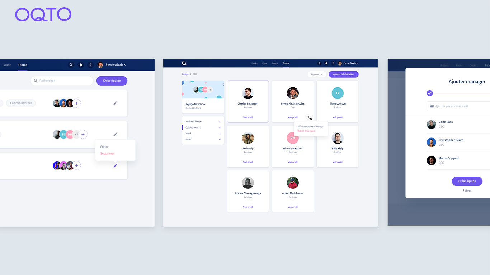

<Image>

</Image>

### Détails du projet

Oqto est une plateforme qui permet aux managers d'engager leurs équipes au quotidien et faire évoluer les carrières de chacun•e dans la direction qui lui convient.

Après une première beta, Oqto avait besoin d'accélérer son développement afin de pouvoir convertir ses premiers utilisateurs. J'ai donc été engagé pour épauler l'équipe technique sur le développement de la fonctionnalité "Teams". Mon expertise avec React, Typescript et Redux a permis de tenir les délais tout en proposant des paradigmes de code qui permettent l'amélioration de l'expérience utilisateur (Optimistic UI)

#### Les points clefs

- Interface de gestion des équipes
- React, Typescript, Redux
- Optimistic UI

<Button href="https://oqto.fr/.ai">Découvrir Oqto</Button>

### Année
2020
