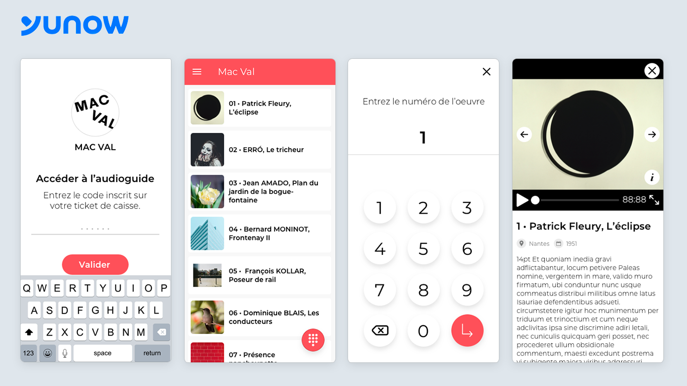

### Project details

Yunow is a plateform to create touch apps for professionals from tourism, culture, education. They work with Chateau de Fontainebleau, MuMa museum, French Vexin National Park...

Because of the Covid-19 pandemic, cultural sites don't have enough employees to follow sanitary measures requires to continue audio-guide lending. I've been missioned to create a digital audio guide, that can be customized through Yunow's plateform, so visitors can access it directly via their smartphone. 

#### Highlights

- Restricted access screen
- Search and quick access to cards
- New presentation layout for artworks

<Button href="https://yunow.io">Discover Yunow</Button>

### Année
2020

### Screenshots

<Image>

</Image>