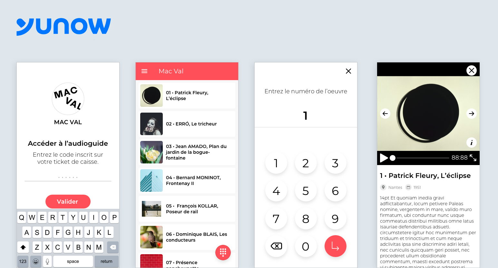

### Détails du projet

Yunow propose une plateforme applicative permettant de créer des applications tactiles pour les professionnels du tourisme, de la culture, de l'éducation. Ils travaillent notamment avec le chateau de Fontainebleau, le musée MuMa, le parc naturel régional du Vexin Français...

Dans le cadre de la réouverture des sites culturels à la suite de la pandémie du Covid-19, les lieux culturels ne sont pas en mesure de répondre aux mesure sanitaires afin de maintenir le prêt d'audio-guides. J'ai donc été missionné pour développer un audio-guide dématérialisé et paramétrable depuis la plateforme Yunow afin que les visiteur puissent y avoir accès directement depuis leurs smartphones.

#### Les points clefs

- Ecran d'accès restreint
- Recherche de fiches et accès rapides par identifiant
- Nouveau layout de présentation des oeuvres

<Button href="https://yunow.io">Découvrir Yunow</Button>

### Année
2020

### Screenshots

<Image>

</Image>
